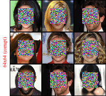
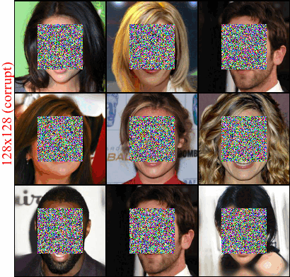
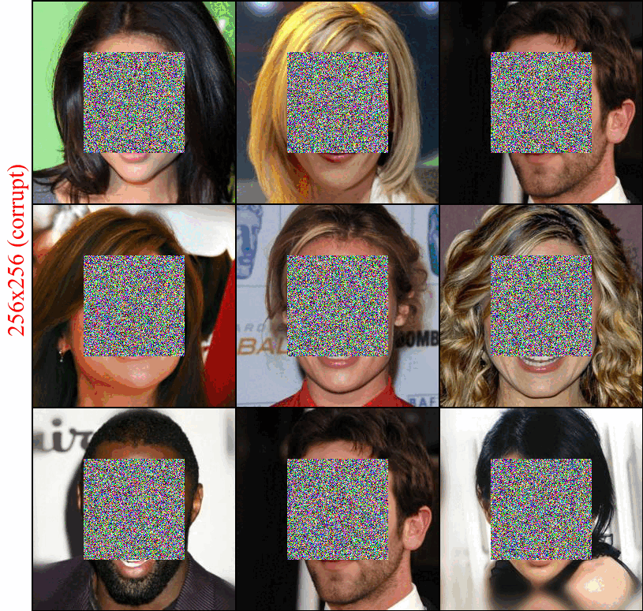

# Multi-FM (work in progress)

FM on CelebA/ImageNet with mutli-resolution image-to-image translation, trained simultaneously.

# Results on inpainting

    

### Run training scripts
* `train.py` trains the model from scratch;
* `sample.py` samples the instances from trained models;
* examples for SLURM training scripts in `exec`;
### Datasets
* convert custom dataset into `LMDB` before training;

### Networks
* Using UNet architecture and code repo from [Guided Diffusion](https://github.com/openai/guided-diffusion/tree/main);

